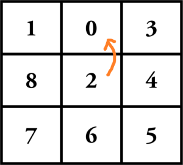
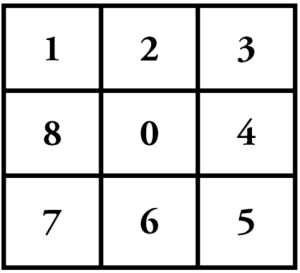
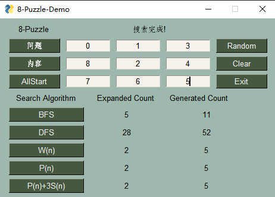

# Graph-Search-for-8-Puzzle
An implementation of DFS graph search, BFS graph search and A* graph search with three different heuristics function. It's a project for our class assignment, which contains a GUI application showing the number of expanded nodes and the number of generated nodes of different graph search algorithm.

## Task Description

**8-Puzzle** is a puzzle divided into 3 rows and 3 columns, containing 8 tiles number from 1 to 8. A tile that is next to the empty space can be moved into the empty space in each step. The aim of the puzzle is to achieve a given configuration of tiles from a given initial state by sliding the tiles. 

In our program, the goal state is set as this (can set it in algorithm.py->GraphSearch->goal):

For clarification, we consider the empty space as a tile numbered 0. And instead of moving the tile into empty space, we can swap the tile 0 with its four neighbors.

## Implementation

We implement Depth-First Search, Breadth-First Search and A* Algorithm. *For detailed information, see:* [Solving 8-Puzzle using A* Algorithm.](https://blog.goodaudience.com/solving-8-puzzle-using-a-algorithm-7b509c331288)

### Class Structure

`    
GraphSearch
      |--BFSSearch
      |--DFSSearch
      |--AStarSearch
          |--AStarSearchW
          |--AStarSearchP
          |--AStarSearchS`

### Different h-score

- **AStarSearchW**: the number of tiles which is not in the expected position in the goal state.
- **AStarSearchP**: the summation of Manhattan distance between each tile and its expected position in the goal state.
- **AStarSearchS**: the sum of *h-score* in *AStarSearchP* and the score of tiles' order. Check the non-center tiles in clock-wise order one by one, if the next tile of the current tile is exactly the followed tile in the goal state, then the score remain the same. If not, add six points into the score. If the number 0 tile isn't in the center, then add three points into the score.

## Setup

Required python 3.*. Required python libraries: Numpy, PySimpleGUI (for GUI).

## How to use

Type the number in the puzzle (it should be exactly from number 0 to number 8). Or hit the random button it will create a random generated puzzle. Hit the AllStart to start all the search algorithm in the same time or choose one you would like to run. After the algorithm finished, the results should show below.

It seems some initial states take too long to run. I don't even know whether if there are bugs or it really takes that long to finish it. Maybe someday I will come back for it. Anyway, PR is welcomed!

**Bug:** However, we failed to kill the running threads (if there are any) when Exit button is hit. So please kill them in the Task Manager.